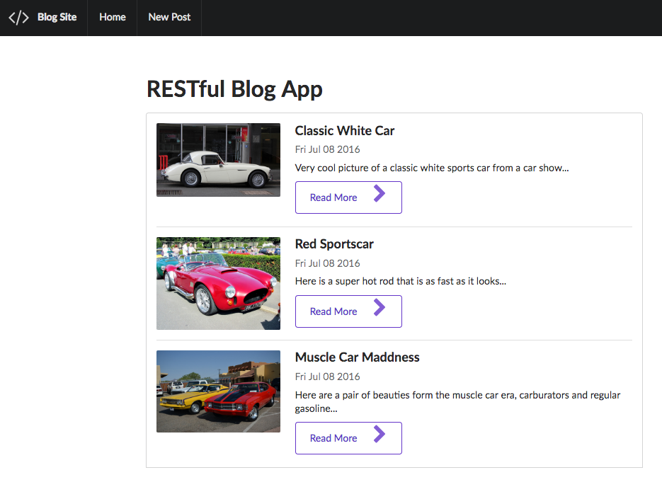
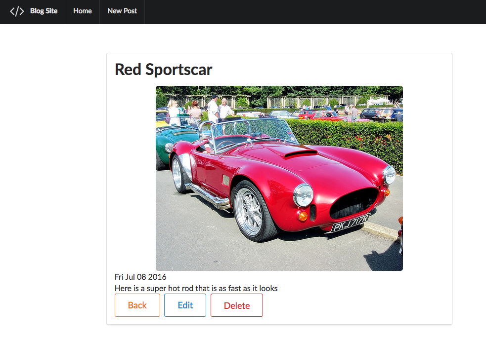
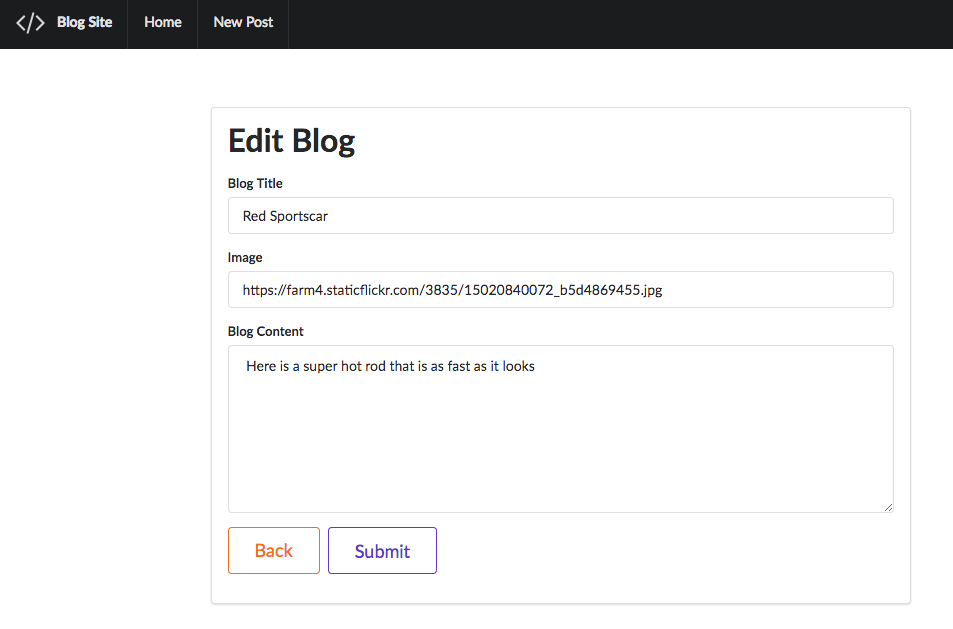

# BLOG APP

This is a RESTful routing application that uses MongoDB and Express to create a very basic blog app that lets
you do basic CRUD operations.

Here is the home page

Here is the Show

Here is the Update

